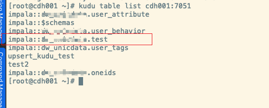

&emsp;&emsp;
本文介绍如何通过 Dinky 整合 Kudu，以支持写 SQL 来实现数据的读取或写入 Kudu。

Flink 官网介绍了如何去自定义一个支持 Source 或者 Sink 的 Connector ，这不是本文探讨的重点，本文侧重于用别人已经写好的Connector 去与 Dinky 做集成以支持读写 Kudu。

<!--truncate-->


> 注意：以下内容基于 Flink1.13.6 和 Dinky 0.6.2，当然其他版本同理

## 准备工作

在Kudu上创建一个表，这里为test



我们还需要一个Flink可以使用的针对kudu的Connector，我们找到[flink-connector-kudu]这个项目，clone该项目并在本地根据本地所使用组件的版本修改代码进行编译。

1、修改pom
```xml
<flink.version>1.13.6</flink.version>
<kudu.version>1.14.0</kudu.version>

<plugins>
   <plugin>
       <groupId>org.apache.maven.plugins</groupId>
       <artifactId>maven-shade-plugin</artifactId>
       <version>3.2.4</version>
       <executions>
           <execution>
               <phase>package</phase>
               <goals>
                   <goal>shade</goal>
               </goals>
           </execution>
       </executions>
   </plugin>
</plugins>
```

这里将Flink版本修改为 1.13.6， 并且使用 1.14.0 版本的 kudu-client，因为项目作者在 README 中已经说明了使用 1.10.0 会存在问题，并且添加了 shade 方式打包。


2、修改 `org.colloh.flink.kudu.connector.table.catalog.KuduCatalogFactory`


## 构建及使用

1、准备工作完毕，我们将项目编译打包(步骤略)，将得到的 jar 放在 flink 的 lib 目录下以及 dinky 的 plugins 目录下，如果需要使用 yarn-application 模式提交任务，还需要将 jar 放在 HDFS 上合适位置让 flink 能访问到。

2、重启 Dinky，如果使用 yarn-session 模式，则需要重启得到一个 session 集群，进入 dinky 的注册中心配置一个合适的集群实例


3、接下来我们去 dinky 的数据开发界面，写一个读取的 SQL demo。
```sql
CREATE TABLE IF NOT EXISTS kudu_test (
id BIGINT,
name STRING
) WITH (
 'connector' = 'kudu',
 'kudu.masters' = 'cdh001:7051,cdh002:7051,cdh003:7051',
 'kudu.table' = 'impala::xxx.test',
 'kudu.hash-columns' = 'id',
 'kudu.primary-key-columns' = 'id'
);

SELECT * FROM kudu_test;
```

点击运行。


4、再来一个写入数据的 SQL demo。

```sql
CREATE TABLE IF NOT EXISTS kudu_test (
id BIGINT,
name STRING
) WITH (
 'connector' = 'kudu',
 'kudu.masters' = 'cdh001:7051,cdh002:7051,cdh003:7051',
 'kudu.table' = 'impala::xxx.test',
 'kudu.hash-columns' = 'id',
 'kudu.primary-key-columns' = 'id'
);

INSERT INTO kudu_test
SELECT 5 AS id , NULLIF('', '') AS name;
```


成功运行，再去查看kudu表的数据。


## 总结
&emsp;&emsp;
目前来说，Dinky 与 Kudu 的整合需要我们做出一些编译工作，甚至是手动对代码的改造，但工作量并不大，并不需要去手动去做 Connector 扩展，在项目使用上 Dinky 提供了较为简单的扩展方式。

&emsp;&emsp;
另外，使用 Dinky 去做 Flink 相关任务的开发，不再需要编写大量的 Java 代码去做兼容适配，以 SQL 的方式交互开发，极大降低了 Flink 开发的入门门槛。

&emsp;&emsp;
Dinky 提供了很多的任务监控管理，可以很方便得知任务的运行状态并进行管理。 内置了SQL语法检查、运行图展示、运行调试等等的功能，实现了类似在 Zeppelin 上开发 Spark 的体验，大大提高了开发效率。

&emsp;&emsp;
我个人很喜欢 Dinky 所提供的功能，并且对其的实现逻辑也很感兴趣，希望 Dinky 能越来越好，功能更强，继续降低 Flink 任务开发的难度和门槛。


