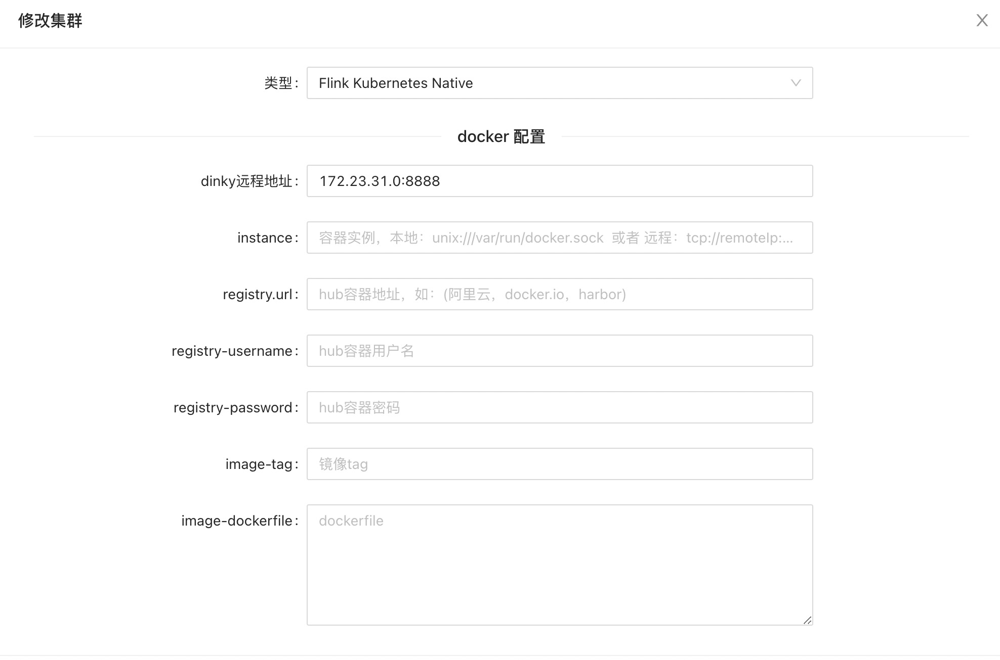
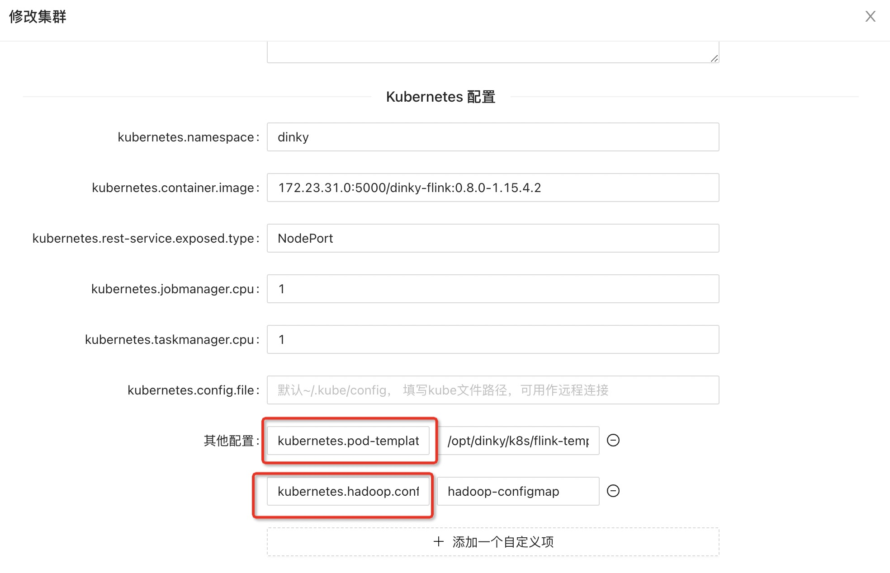
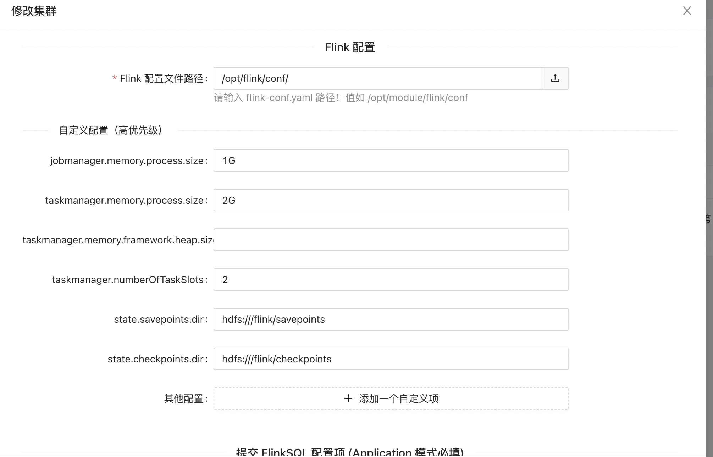
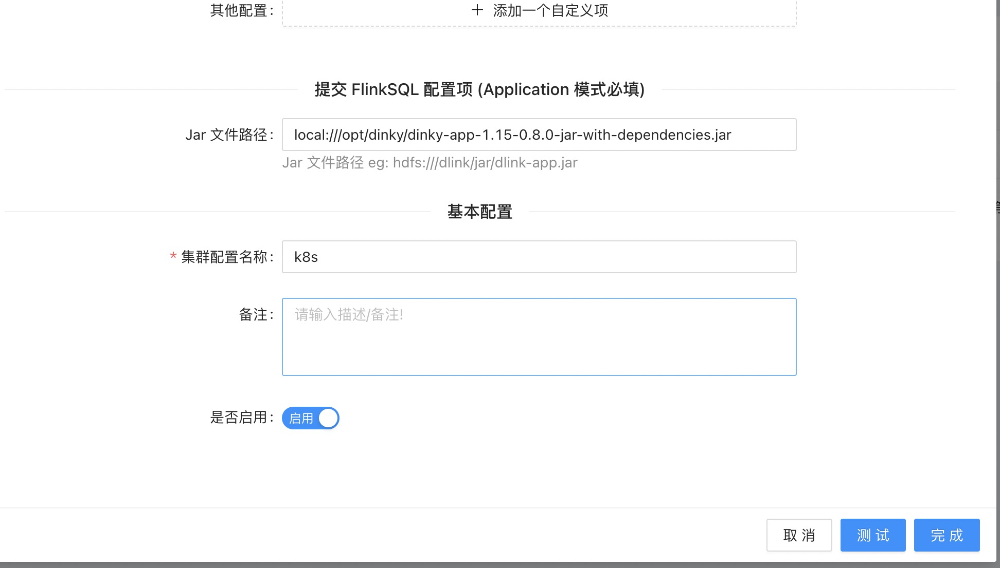

import Tabs from '@theme/Tabs';
import TabItem from '@theme/TabItem';


## k8s 环境初始化
**1. Flink 对应集成 k8s 文档链接**

<Tabs groupId="flink-version">
<TabItem value="1.12" label="flink-1.12" default>

[https://nightlies.apache.org/flink/flink-docs-release-1.12/zh/docs/deployment/resource-providers/native_kubernetes/](https://nightlies.apache.org/flink/flink-docs-release-1.16/zh/docs/deployment/resource-providers/native_kubernetes/)

</TabItem>
<TabItem value="1.13" label="flink-1.13" default>

[https://nightlies.apache.org/flink/flink-docs-release-1.13/zh/docs/deployment/resource-providers/native_kubernetes/](https://nightlies.apache.org/flink/flink-docs-release-1.16/zh/docs/deployment/resource-providers/native_kubernetes/)

</TabItem>
<TabItem value="1.14" label="flink-1.14" default>

[https://nightlies.apache.org/flink/flink-docs-release-1.14/zh/docs/deployment/resource-providers/native_kubernetes/](https://nightlies.apache.org/flink/flink-docs-release-1.16/zh/docs/deployment/resource-providers/native_kubernetes/)

</TabItem>
<TabItem value="1.15" label="flink-1.15" default>

[https://nightlies.apache.org/flink/flink-docs-release-1.15/zh/docs/deployment/resource-providers/native_kubernetes/](https://nightlies.apache.org/flink/flink-docs-release-1.16/zh/docs/deployment/resource-providers/native_kubernetes/)

</TabItem>
<TabItem value="1.16" label="flink-1.16" default>

[https://nightlies.apache.org/flink/flink-docs-release-1.16/zh/docs/deployment/resource-providers/native_kubernetes/](https://nightlies.apache.org/flink/flink-docs-release-1.16/zh/docs/deployment/resource-providers/native_kubernetes/)

</TabItem>
</Tabs>

**2. 执行如下命令，以便增加 RBAC 权限**
```shell
# 创建命名空间
kubectl create namespace dinky
# 为命名空间创建权限
kubectl create clusterrolebinding flink-role-binding-default --clusterrole=edit --serviceaccount=dinky:default
```

:::tip
其中有个 NAMESPACE 变量，就是你需要运行flink集群的k8s命名空间
```shell
kubectl create clusterrolebinding flink-role-binding-default --clusterrole=edit --serviceaccount=${NAMESPACE}:default
```
:::

---
## 镜像制作
### 自定义制作镜像
#### 搭建私有镜像仓库
##### 配置Registry
1、拉取镜像
```shell
docker pull registry
```
2、创建镜像存贮目录
```shell
mkdir /docker/registry -p
```
3、运行registry
```shell
docker run -itd -v /docker/registry/:/docker/registry -p 5000:5000 --restart=always --name registry registry:latest
```
参数说明：
* -itd：在容器中打开伪终端进行交互操作，并在后台运行
* -v：容器目录与主机目录映射，用于存储镜像
* -p：容器端口与主机端口映射，用于对外服务
* --restart=always：指定重启策略
* --name registry：指定容器名称为registry
* registry:latest：指定容器镜像

##### 配置Clinet
指定registry地址及端口
```shell
vim /etc/docker/daemon.json

# 添加如下内容
{
  "insecure-registries": ["192.168.0.10:5000"]
}
```
192.168.0.10 为安装私有镜像仓库机器IP


#### Dockerfile模板修改
`Dinky_HOME/config/DinkyFlinkDockerfile` 提供 Dockerfile，内置flink1.15制作方案。如需使用其他版本，请按照对应修改；

```shell
ARG FLINK_VERSION=1.15.4
ARG FLINK_BIG_VERSION=1.15

FROM flink:${FLINK_VERSION}-scala_2.12

ARG FLINK_VERSION
ARG FLINK_BIG_VERSION
ENV PYTHON_HOME /opt/miniconda3

USER root
RUN wget "https://s3.jcloud.sjtu.edu.cn/899a892efef34b1b944a19981040f55b-oss01/anaconda/miniconda/Miniconda3-py38_4.9.2-Linux-x86_64.sh" -O "miniconda.sh" && chmod +x miniconda.sh
RUN ./miniconda.sh -b -p $PYTHON_HOME && chown -R flink $PYTHON_HOME && ls $PYTHON_HOME

RUN mkdir /opt/dinky
ADD app /opt/dinky
ADD plugins /opt/flink/lib

ENV HADOOP_VERSION 3.3.4
ENV HADOOP_HOME=/opt/hadoop
ADD hadoop-${HADOOP_VERSION}.tar.gz /opt
RUN ln -s /opt/hadoop-${HADOOP_VERSION} ${HADOOP_HOME}
ENV HADOOP_CLASSPATH=${HADOOP_HOME}/etc/hadoop:${HADOOP_HOME}/share/hadoop/common/lib/*:${HADOOP_HOME}/share/hadoop/common/*:${HADOOP_HOME}/share/hadoop/hdfs:${HADOOP_HOME}/share/hadoop/hdfs/lib/*:${HADOOP_HOME}/share/hadoop/hdfs/*:${HADOOP_HOME}/share/hadoop/yarn/lib/*:${HADOOP_HOME}/share/hadoop/yarn/*:${HADOOP_HOME}/share/hadoop/mapreduce/lib/*:${HADOOP_HOME}/share/hadoop/mapreduce/*:${HADOOP_HOME}/contrib/capacity-scheduler/*.jar
ENV HADOOP_CONF_DIR=${HADOOP_HOME}/conf
ENV PATH=${PATH}:${HADOOP_CLASSPATH}:${HADOOP_CONF_DIR}:${HADOOP_HOME}/bin

USER flink
RUN rm -rf ${FLINK_HOME}/lib/flink-table-planner-loader-1.15.4.jar
ENV PATH $PYTHON_HOME/bin:$PATH
RUN pip install "apache-flink==${FLINK_VERSION}" -i http://pypi.douban.com/simple/ --trusted-host pypi.douban.com
```
app目录下文件  
dinky-app-1.15-0.8.0-jar-with-dependencies.jar

plugins目录下文件
flink-table-common-1.15.4.jar
flink-table-planner_2.12-1.15.4.jar


#### 构建镜像并推送到私有镜像仓库
```shell
docker build -t dinky-flink:0.8.0-1.15.4 . --no-cache

docker tag dinky-flink:0.8.0-1.15.4 192.168.0.10:5000/dinky-flink:0.8.0-1.15.4

docker push 192.168.0.10:5000/dinky-flink:0.8.0-1.15.4
```

### 通过页面构建镜像
`注册中心 -> 集群管理 -> 集群配置管理 -> 新建 -> 测试`

> 当配置好信息后，点击测试，大约3-5分钟左右就出现测试成功案例，此刻输入 `docker images` ，即可查看构建成功的镜像


参数详解
* instance:  容器实例，本地：unix:///var/run/docker.sock  或者 远程：tcp://remoteIp:2375（目前远程不支持使用 **COPY** 指令，请合理规避）
* registry.url: hub容器地址，如：(阿里云，docker.io，harbor)
* （registry-username  registry-password）: hub登录凭证
* image-namespace: 镜像命名空间
* image-storehouse: 镜像仓库
* image-dinkyVersion: 镜像版本
* dinky远程地址： 此参数是k8s 容器与dinky通讯的地址

## 配置k8s Pod访问宿主机dinky服务
```shell
cd  /opt/dinky/k8s
cat <<EOF > dinky-endpoints.yaml
apiVersion: v1
kind: Endpoints
metadata:
  name: dinky-endpoint
  namespace: dinky
subsets:
  - addresses:
      - ip: 192.168.0.10
    ports:
    - name: port3306
      port: 3306
    - name: port8888
      port: 8888
EOF

cat <<EOF > dinky-service.yaml
apiVersion: v1
kind: Service
metadata:
  name: dinky-endpoint
  namespace: dinky
spec:
  ports:
  - name: port3306
    protocol: TCP
    port: 3306
  - name: port8888
    protocol: TCP
    port: 8888
EOF

# 创建endpoint

kubectl create -f dinky-endpoints.yaml

# 创建service
kubectl create -f dinky-service.yaml

# 查看endpoint
kubectl get endpoints dinky-endpoint -n dinky

# 查看service
kubectl get svc dinky-endpoint  -n dinky
```

## 配置k8s Pod访问hadoop服务
cd  /opt/dinky/k8s
```shell
cat <<EOF > dinky_emr_external_name.yaml
apiVersion: v1
kind: Service
metadata:
  name: dinky-namenode-0-externalname
  namespace: dinky
spec:
  type: ExternalName
  externalName: my-hdfs-namenode-0.my-hdfs-namenode.my-hdfs.svc.cluster.local
  ports:
  - name: namenode-0
    port: 8020
    targetPort: 8020
---
apiVersion: v1
kind: Service
metadata:
  name: dinky-namenode-1-externalname
  namespace: dinky
spec:
  type: ExternalName
  externalName: my-hdfs-namenode-1.my-hdfs-namenode.my-hdfs.svc.cluster.local
  ports:
  - name: namenode-1
    port: 8020
    targetPort: 8020
---
apiVersion: v1
kind: Service
metadata:
  name: dinky-zookeeper-0-externalname
  namespace: dinky
spec:
  type: ExternalName
  externalName: my-hdfs-zookeeper-0.my-hdfs-zookeeper-headless.my-hdfs.svc.cluster.local
  ports:
  - name: zookeeper-0
    port: 2181
    targetPort: 2181
---
apiVersion: v1
kind: Service
metadata:
  name: dinky-zookeeper-1-externalname
  namespace: dinky
spec:
  type: ExternalName
  externalName: my-hdfs-zookeeper-1.my-hdfs-zookeeper-headless.my-hdfs.svc.cluster.local
  ports:
  - name: zookeeper-1
    port: 2181
    targetPort: 2181
---
apiVersion: v1
kind: Service
metadata:
  name: dinky-zookeeper-2-externalname
  namespace: dinky
spec:
  type: ExternalName
  externalName: my-hdfs-zookeeper-2.my-hdfs-zookeeper-headless.my-hdfs.svc.cluster.local
  ports:
    - name: zookeeper-2
      port: 2181
      targetPort: 2181
EOF
```
创建
kubectl create -f dinky_emr_external_name.yaml

查看
kubectl get svc -n dinky

## 创建hadoop confmap
cd  /opt/dinky/k8s
```shell
cat <<EOF > hadoop-configmap.yaml
apiVersion: v1
kind: ConfigMap
metadata:
  name: hadoop-configmap
data:
  core-site.xml: |
    <?xml version="1.0"?>
    <?xml-stylesheet type="text/xsl" href="configuration.xsl"?>
    <configuration>
      <property>
        <name>hadoop.proxyuser.dcos.groups</name>
        <value>*</value>
      </property>
      <property>
        <name>hadoop.proxyuser.dcos.hosts</name>
        <value>*</value>
      </property>
      <property>
        <name>hadoop.proxyuser.ec2-user.groups</name>
        <value>*</value>
      </property>
      <property>
        <name>hadoop.proxyuser.ec2-user.hosts</name>
        <value>*</value>
      </property>
      <property>
        <name>hadoop.proxyuser.hive.groups</name>
        <value>*</value>
      </property>
      <property>
        <name>hadoop.proxyuser.hive.hosts</name>
        <value>*</value>
      </property>
      <property>
        <name>hadoop.proxyuser.httpfs.groups</name>
        <value>*</value>
      </property>
      <property>
        <name>hadoop.proxyuser.httpfs.hosts</name>
        <value>*</value>
      </property>
      <property>
        <name>hadoop.proxyuser.hue.groups</name>
        <value>*</value>
      </property>
      <property>
        <name>hadoop.proxyuser.hue.hosts</name>
        <value>*</value>
      </property>
      <property>
        <name>hadoop.proxyuser.livy.groups</name>
        <value>*</value>
      </property>
      <property>
        <name>hadoop.proxyuser.livy.hosts</name>
        <value>*</value>
      </property>
      <property>
        <name>hadoop.proxyuser.root.groups</name>
        <value>*</value>
      </property>
      <property>
        <name>hadoop.proxyuser.root.hosts</name>
        <value>*</value>
      </property>
      <property>
        <name>hadoop.proxyuser.sqoop.groups</name>
        <value>*</value>
      </property>
      <property>
        <name>hadoop.proxyuser.sqoop.hosts</name>
        <value>*</value>
      </property>
      <property>
        <name>hadoop.proxyuser.zeppelin.groups</name>
        <value>*</value>
      </property>
      <property>
        <name>hadoop.proxyuser.zeppelin.hosts</name>
        <value>*</value>
      </property>
      <property>
        <name>hadoop.tmp.dir</name>
        <value>/usr/local/hadoop/tmp</value>
      </property>
      <property>
        <name>fs.defaultFS</name>
        <value>hdfs://default</value>
      </property>
      <property>
        <name>ha.zookeeper.quorum</name>
        <value>my-hdfs-zookeeper-1.my-hdfs-zookeeper-headless.my-hdfs.svc.cluster.local:2181,my-hdfs-zookeeper-2.my-hdfs-zookeeper-headless.my-hdfs.svc.cluster.local:2181,my-hdfs-zookeeper-0.my-hdfs-zookeeper-headless.my-hdfs.svc.cluster.local:2181</value>
      </property>
      <property>
        <name>ha.zookeeper.parent-znode</name>
        <value>/hadoop-ha/hdfs-k8s</value>
      </property>
      <property>
        <name>fs.trash.interval</name>
        <value>1440</value>
      </property>
      <property>
        <name>fs.trash.checkpoint.interval</name>
        <value>0</value>
      </property>
      <property>
        <name>fs.permissions.umask-mode</name>
        <value>037</value>
      </property>
    </configuration>

  hdfs-site.xml: |
    <?xml version="1.0"?>
    <?xml-stylesheet type="text/xsl" href="configuration.xsl"?>
    <configuration>
      <property>
        <name>dfs.nameservices</name>
        <value>default</value>
      </property>
      <property>
        <name>dfs.ha.namenodes.default</name>
        <value>nn0,nn1</value>
      </property>
      <property>
        <name>dfs.namenode.rpc-address.default.nn0</name>
        <value>my-hdfs-namenode-0.my-hdfs-namenode.my-hdfs.svc.cluster.local:8020</value>
      </property>
      <property>
        <name>dfs.namenode.rpc-address.default.nn1</name>
        <value>my-hdfs-namenode-1.my-hdfs-namenode.my-hdfs.svc.cluster.local:8020</value>
      </property>
      <property>
        <name>dfs.namenode.shared.edits.dir</name>
        <value>qjournal://my-hdfs-journalnode-1.my-hdfs-journalnode.my-hdfs.svc.cluster.local:8485;my-hdfs-journalnode-2.my-hdfs-journalnode.my-hdfs.svc.cluster.local:8485;my-hdfs-journalnode-0.my-hdfs-journalnode.my-hdfs.svc.cluster.local:8485/default</value>
      </property>
      <property>
        <name>dfs.ha.automatic-failover.enabled</name>
        <value>true</value>
      </property>
      <property>
        <name>dfs.ha.fencing.methods</name>
        <value>
          sshfence
          shell(/bin/true)
        </value>
      </property>
      <property>
        <name>dfs.ha.fencing.ssh.private-key-files</name>
        <value>/etc/security/ssh/id_rsa</value>
      </property>
      <property>
        <name>dfs.journalnode.edits.dir</name>
        <value>/hadoop/dfs/journal</value>
      </property>
      <property>
        <name>dfs.client.failover.proxy.provider.default</name>
        <value>org.apache.hadoop.hdfs.server.namenode.ha.ConfiguredFailoverProxyProvider</value>
      </property>
      <property>
        <name>dfs.namenode.name.dir</name>
        <value>file:///hadoop/dfs/name</value>
      </property>
      <property>
        <name>dfs.namenode.datanode.registration.ip-hostname-check</name>
        <value>false</value>
      </property>
      <property>
        <name>dfs.namenode.rpc-bind-host</name>
        <value>0.0.0.0</value>
      </property>
      <property>
        <name>dfs.namenode.http-bind-host</name>
        <value>0.0.0.0</value>
      </property>
      <property>
        <name>dfs.datanode.handler.count</name>
        <value>10</value>
      </property>
      <property>
        <name>dfs.datanode.max.xcievers</name>
        <value>8192</value>
      </property>
      <property>
        <name>dfs.datanode.max.transfer.threads</name>
        <value>8192</value>
      </property>
      <property>
        <name>dfs.datanode.data.dir</name>
        <value>/hadoop/dfs/data/0</value>
      </property>
      <property>
        <name>dfs.client.use.datanode.hostname</name>
        <value>true</value>
      </property>
      <property>
        <name>dfs.datanode.use.datanode.hostname</name>
        <value>false</value>
      </property>
      <property>
        <name>dfs.replication</name>
        <value>3</value>
      </property>
    </configuration>
EOF
```
创建ConfigMap
```shell
kubectl create configmap  hadoop-configmap -n dinky --from-file=/opt/dinky/k8s/hadoop-configmap.yaml
```
查看ConfigMap
```shell
kubectl get configmap -n dinky
```

### 创建pod
cd /opt/dinky/k8s
```shell
cat <<EOF > pod-template.yaml
apiVersion: v1
kind: Pod
metadata:
  name: flink-pod-template
spec:
  initContainers:
    - name: init-volume-mount
      image: 192.168.0.10:5000/dinky-flink:0.8.0-1.15.4
      command: [ 'sh', '-c', 'chown -R flink:flink /opt/flink/log']
      volumeMounts:
        - name: flink-logs
          mountPath: /opt/flink/log
  containers:
    - name: flink-main-container
      volumeMounts:
        - name: flink-logs
          mountPath: /opt/flink/log
  volumes:
    - name: flink-logs
      hostPath:
        path: /data/logs/flink/
        type: Directory
EOF  
```

## 创建k8s类型集群配置






配置参数如下
```shell
dinky远程地址:172.23.31.0:8888
# k8s 名字空间
kubernetes.namespace:dinky
# 使用私有镜像地址
kubernetes.container.image:192.168.0.10:5000/dinky-flink:0.8.0-1.15.4
kubernetes.rest-service.exposed.type:NodePort
kubernetes.jobmanager.cpu:1
kubernetes.taskmanager.cpu:1
kubernetes.pod-template-file:/opt/dinky/k8s/pod-template.yaml
# 指定hadoop configmap 名称
kubernetes.hadoop.conf.config-map.name:hadoop-configmap
Flink 配置文件路径:/opt/flink/conf/
jobmanager.memory.process.size:1G
taskmanager.memory.process.size:2G
taskmanager.numberOfTaskSlots:2
state.savepoints.dir:hdfs:///flink/savepoints
state.checkpoints.dir:hdfs:///flink/checkpoints
Jar 文件路径:local:///opt/dinky/dinky-app-1.15-0.8.0-jar-with-dependencies.jar
```